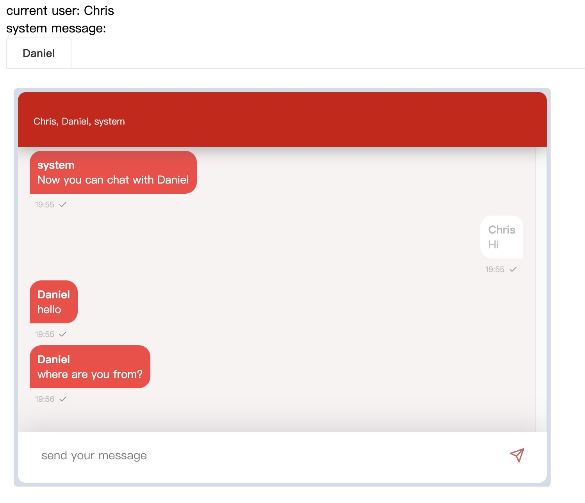

# chat
[](https://github.com/vearne/chat/actions/workflows/golang-ci.yml)

This chat system is designed to automatically match strangers for chat, so no registration is required

## Online service
[chat.vearne.cc](http://chat.vearne.cc/)

## Quick Start with Docker compose
```
cd docker_compose
```

### start

```
docker-compose up -d
```

### stop
```
docker-compose down
```


### Interface


### 3. Thanks
>"If I have been able to see further, it was only because I stood on the shoulders of giants."   by Isaac Newton

