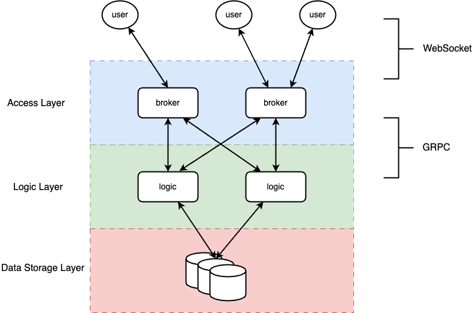

# chat

### 1. 功能说明
这个聊天系统被设计为陌生人自动匹配进行聊天，因此不需要注册。分为2个模块，在线体验地址 [chat.vearne.cc](http://chat.vearne.cc/)      

**提示**：如果无法匹配到其它聊天对象，可以在浏览器中多开几个窗口，自己和自己聊


#### 1.1 客户端 [github.com/vearne/chat-ui](https://github.com/vearne/chat-ui)
客户端采用Vue开发
依赖组件 [MatheusrdSantos/vue-quick-chat](https://github.com/MatheusrdSantos/vue-quick-chat)

#### 1.2 服务端 [github.com/vearne/chat](https://github.com/vearne/chat)
采用golang开发，使用的框架
[olahol/melody](https://github.com/olahol/melody) -- websocket框架
[grpc/grpc-go](https://github.com/grpc/grpc-go)  -- grpc框架

**架构图**

客户与接入层的通讯采用websocket + 自定义的文本协议实现。
自定义的协议其实都是携带着各种命令的JSON字符串，很容易看懂
比如 创建一个新的账号(由客户端发出)
##### request
```
{
	"cmd": "CRT_ACCOUNT",
	"nickName": "XXXX"
}
```
##### response
```
{
	"cmd": "CRT_ACCOUNT",
	"nickName": "XXXX",
	"accountId": 1111
}
```
又比如 匹配一个聊天对象
##### request
```
{
	"cmd": "MATCH",
	"accountId": 1111
}
```
##### response
```
{
	"cmd": "MATCH",
	"partnerId": 1111,
	"partnerName": "xxxx",
	"sessionId": 10000
	"code": 0
}
```
具体请看wiki相关页面

### 2. 实际效果


### 3. 感谢
>"If I have been able to see further, it was only because I stood on the shoulders of giants."   by Isaac Newton

