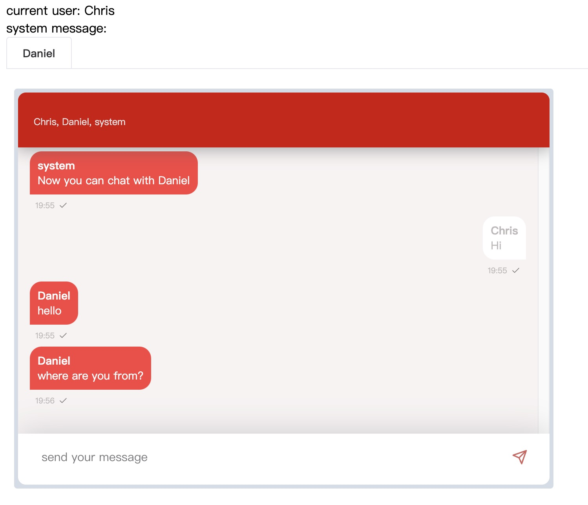
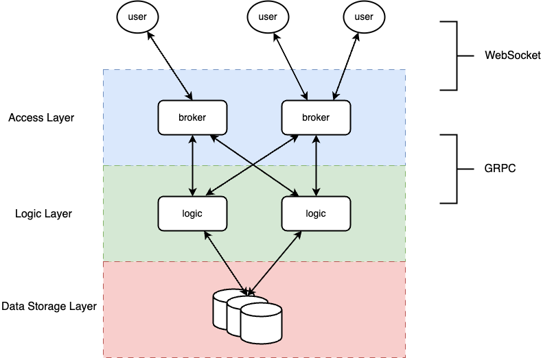

# chat
[](https://github.com/vearne/chat/actions/workflows/golang-ci.yml)

chat是一个对陌生人随机匹配的聊天系统。

[English README](./README.md)

## 在线服务
[chat.vearne.cc](http://chat.vearne.cc/)

注意：如果无法配到到其他人, 您可以打开多个窗口并与自己聊天。
## 使用Docker compose快速开始
切换到目录 [docker_compose](https://github.com/vearne/chat/tree/master/docker_compose)
```
cd docker_compose
```

### 启动

```
docker-compose up -d
```

### 停止
```
docker-compose down
```
然后，你可以打开浏览器，并访问
http://localhost/

### 交互界面
注意：如果无法配到到其他人, 您可以打开多个窗口并与自己聊天。


### 架构


### 数据库表设计
[database](./docs/mysql_zh.md)

### Websocket 命令
[command](./docs/command_zh.md)

### 配套项目
[chat-ui](https://github.com/vearne/chat-ui)

### 感谢
>"If I have been able to see further, it was only because I stood on the shoulders of giants."   by Isaac Newton

