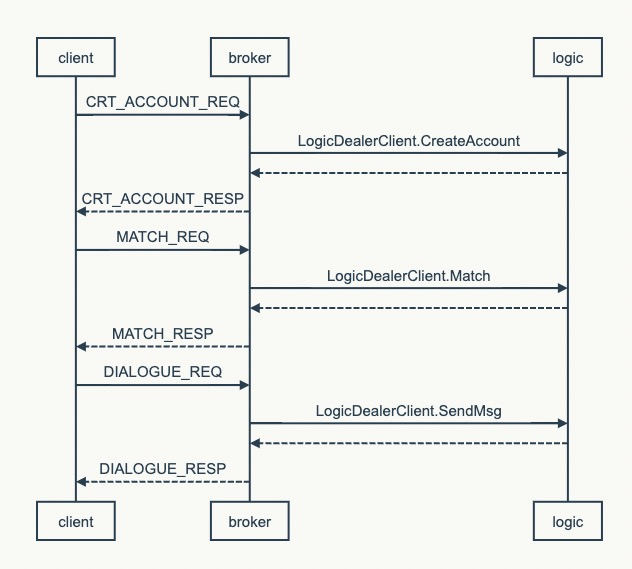

## The protocol for interaction between the device and broker.
websocket + JSON


```
    client                      broker

# Request to create a temporary account
CRT_ACCOUNT_REQ       -->
                      <--     CRT_ACCOUNT_RESP
# Request to match a chat partner                   
MATCH_REQ             -->
                      <--     MATCH_RESP
# Send a conversation message
DIALOGUE_REQ          -->     
                      <--     DIALOGUE_RESP

# Receive a conversation message                   
                      <--     PUSH_DIALOGUE_REQ
PUSH_DIALOGUE_RESP    -->     
                    
# Receive a system message (chat partner offline, etc.)
                      <--     PUSH_SIGNAL_REQ
PUSH_SIGNAL_RESP      -->     

# Ping
PING_REQ              -->     
                      <--     PING_RESP

# Inform the other party that the message has been read                 
VIEWED_ACK_REQ        -->
                      <--     VIEWED_ACK_RESP
  
# Receive notification that the message from the sender has been read by the recipient              
                      <--     PUSH_VIEWED_ACK_REQ
PUSH_VIEWED_ACK_RESP  -->     

# Attempt to reconnect after a sudden disconnection
RECONNECT_REQ         -->     
                      <--     RECONNECT_RESP          

```

## Sequence diagram

